# Sociotechnical guardrails for AI-driven application testing

This talks-turned-articles post is part of *Maaret Pyhäjärvi Digital Legacy CGI Edition © 2024 by Maaret Pyhäjärvi*. It is licensed under [CC BY-NC-SA 4.0](https://creativecommons.org/licenses/by-nc-sa/4.0/). 

These days, everyone seems to be somewhat of an expert in the area of AI. To a degree, everyone is. We have been using these technologies without being able to recognize when we are using them, and conflating things is the go-to for marketing purposes. It does sound better to use AI than to automate, even if a lot of the things we are doing don't require something beyond a regular algorithm, not those with machine learning from data.

In this talk, and talk-turned-article, I reflect on what guardrails that keep me focused, in hopes of some of that helping you on your journey.

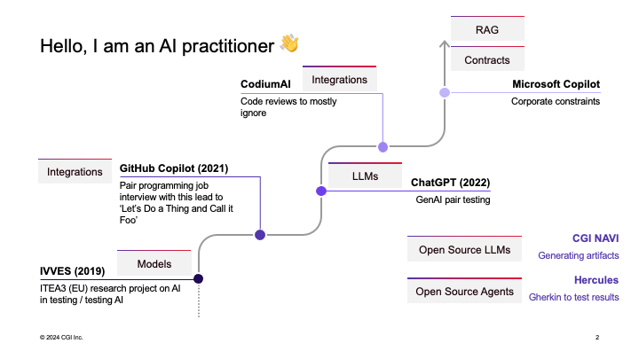

In AI, we have two kinds of smart creatives:

* *Builders* take the technologies and create new kinds of wrappers for those. Sometimes wrappers are as simple as adding a new name to someone else's technology. Sometimes wrappers take an idea and create an entirely diffent thing into the same category. We add names, user interfaces, tuning parameters, traditional logic, AI-based API calls, new ML-models, logic chains fit for purpose and we get to the variety of things the world now has to offer. I play with building, but I am not a builder.

* *Practitioners* take the things built and make use of those in practice. Good practitioners tend to dabble in building to understand what is possible and make sense of things, and they explain what they do so that builders end up incorporating experiences into things being built. There's plenty of work in using technologies, without building them.

So I am a practitioner. Most of us are. Why do I then get to share my practitioner advice from a stage? 

I have been a practitioner for a few years now. I started, intentionally, in 2019 with a research project we set up at my work. In case you aren't aware, research projects are what we do in companies when there is a lot to learn, and we could together with others, and apply what we learn to know figure things out. So we got a few millions of a budget for learning with some lovely people. We were trying to figure out both *how to test systems with AI in them* and *how to use AI to test systems*. Being interviewed after the project, the summary suggested we essentially learned that there were two things making applying AI in testing hard: the data (we don't really collect high quality data systematically) and the payer for the AI work. If and when AI was to be used, testing was not considered the first area of excited business application.

Out of the initial practitioner perspective, I picked up the idea that there is *machine learning* and that produces *models*. Models are like algorithms, created from data instead of human analyzed rules.

In 2021, Github Copilot was published. Already following the model creation keenly, I was quick to get myself in line for access. And I was privileged to get access quite early on. Creating code with a model fit my interests nicely, and I even dragged the tool to a pair programming interview with me. At least that paired with me, when the developer I was assigned to pair with refused to pair because of needing to assess me. I quite enjoyed pairing with a model with *integration to IDE* so that the output was right at my fingertips. I learned that a bad pair serves as external imagination, bringing the best out of me, as I showed off how I would test something that AI writes. Made a talk out of that experience, showing the world how we know so little of roman numerals, and get fooled by the things we don't know.

When ChatGPT was published, I worked with a group of aspiring testers I called Testing Dozen, and we played with that since its first week. Seeing how hard modeling probabilistic text generators was for other testers lead to an insight that we have a long way to go, but also into a routine of ChatGPT pair testing. With the written language, it was clear there was something that needed its own name, and we started talking about *large language models (LLM)*. The chat-like UI was an integration that added to its popularity. 

More models and large language models emerged. More integrations emerged. Amount of tools with promises skyrocketed. We started learning to sum up API costs and license costs hiding API costs, and one of the tools I got to watch in action was a freebie given to Selenium open source project. Watching generated documentation and review comments was an interesting use case of a team member everyone dismisses until it says something worth reacting to. Again *integration to pull requests* made it particularly nice.

Right now I practice at a larger company, and while I get to try out tons of new fancy tools, the real practitioner work I do in testing relies on access to Microsoft Copilot. It comes with *corporation to corporation contracts* that provide protection for data, and inputs that allow me to do simple *retrieval augmented generation (RAG)* by providing more context than what is visible when calling a model.

I can't really mention all the tools, there are just too many of them. But today I mention two on top of the ones that have paved my way to insights:

* CGI NAVI is a product some work colleagues are building, where the mix of open source large language models, self-hosted, allows us to keep data away from the other corporations. We've learned to put together RAG, models, large language models and test task analysis around artifacts to create something of our own for practitioners like me to consider.

* Hercules is an open source agentic AI tool, where one transforms Gherkin to test results. Demos suggest it might sometimes work for automating tests without automating them manually.

I am a practitioner, but I am a practitioner who follows the field of AI-driven application testing. I am also a director responsible for AI-driven application testing, and as such work to help pave the way to other practitioners.

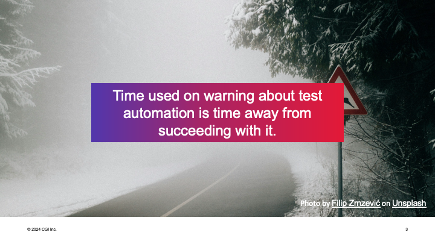

Before I became an AI practitioner, I was already a testing practitioner, a test automation practitioner. With that I learned one thing that has proven particularly useful in the AI in testing space:

Opportunity cost: **Time used on warning about test automation is time away from succeeding with it**

AI is automation. It's automating the things we did not know how to automate before, increasing the level of automation. And just like with other automation, we can warn about it. We can talk about how it does not do everything, how humans in the loop are valuable, and how time into it may actually make things worse because our focus becomes the new-shiny instead of the valuable.

At the same time, we need smart hands on deck to figure out how to succeed with technologies that are limited. We need focus on what we can do (and how) even if as tester we tend to have an inclination to warn about the risks.

I used to have failing automation around me, and I used to have the right to say 'I told you so'. Until I realized my contribution FOR it is what separates failure from success. And that is the framing I work on AI with. With that, we look at successes and guardrails - positive framing of the directions we need to keep in mind to stay on route.

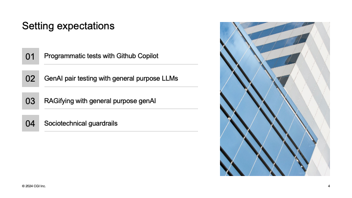

For introducing you all to sociotechnical guardrails, we look at three static 'demos', just to give you ideas of what you can use. I've chosen the examples so that they would be widely available.

With the three examples in mind, we then look at sociotechnical guardrails. These are principles that we draw from use of tools, and learning from it.

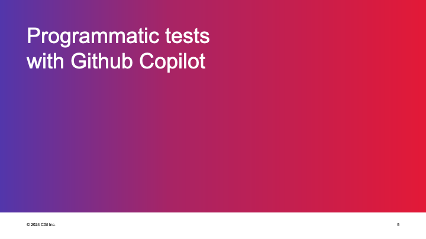

The first static demo we look at is of Github Copilot, to make sure we all have a shared basic understanding of what we can do with it for *testing purposes*.

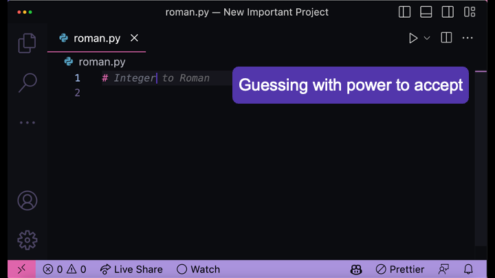

Github Copilot is an assistant. You can think of it as predictive text for programming in your IDE. Seeing a proposal allows you to accept or reject it. Your context in IDE comes from various things: your file name hints on what you might be creating; same applies for a comment you write, or starting to write your code.

Being clear with your *intent* makes the predictive text more likely to do something useful.

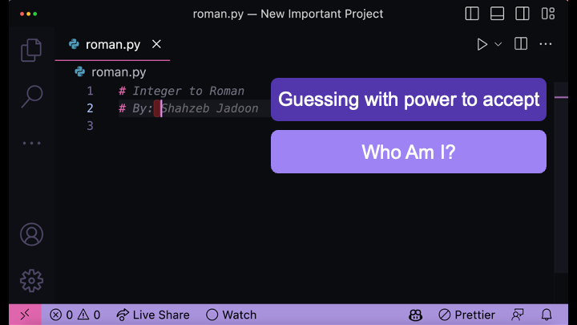

The predictive text of one day may not be the predictive text of another day. I used to have a lot of fun collecting people's names, and finding it hilarous that it would never guess me as an author, and thus provide me regular reminders that the training material is open source, which means it's licensed in a way where these uses most likely break the license terms.

Over time, it has become slightly harder to get names out of it. The tool creators make changes and anything specific one says - or even screenshots - can change. Continuous learning through exploring is necessary for these tools.

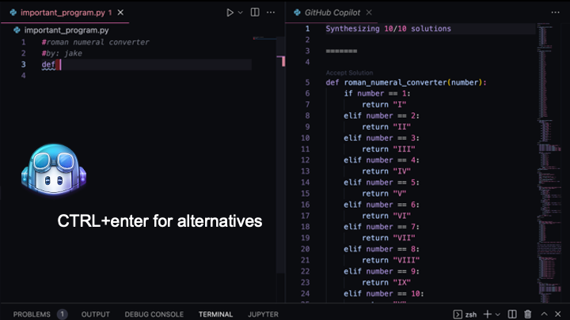

While Github Copilot guesses for you when you type ahead, you can also ask it to guess with CTRL+Enter. In this particular case, it guesses multiple options. It took me a bit of setup to get it to guess a fairly bad structure of an option as the first one - again, the context on the other open files matters.

I originally saw this one much later in the lists, but since it reminded me of the first piece of code I wrote as teenager, I really wanted to keep this one around. In case you are not immediately recognizing what is wrong with this, let's be clear: it's never good approach to separately code each possible case when is an algorithm solving the problem in more generic fashion available.

Seeing many options tends to bring out the reviewer in us, recognizing what we don't want; maybe even what we do want.

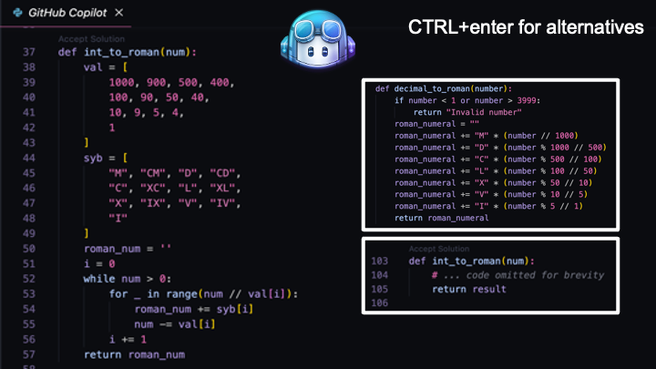

Eventually, whatever we choose, we review. When Github Copilot then collects statistics of how much code it writes for people, it's most likely the accepted pieces they are counting. Not sure if they deduct the code we delete after first acceptance. But we don't work for the statistics, we work for getting out problems in code solved, with whatever flow and process of thinking that works for us.

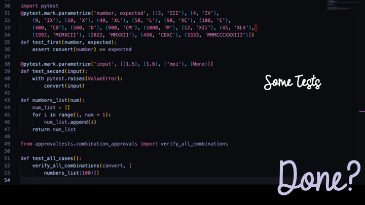

Whatever we choose and review, we also test. Current experience of unit tests in Github Copilot still suggest it does not write what we consider **good** unit tests. Multiple inputs in single test don't automatically end up as parametrized tests. Multiple asserts in single test result in less granular feedback with first failure hiding other failures. And it does not propose a mix of mocks, asserts, approvals, property-based tests, but you have to have your own foundational ideas about what you are setting up.

The test examples on the slide are by human, not by AI. Everything AI creates needs testing. This is why we say the future with AI is *testing-centric*.

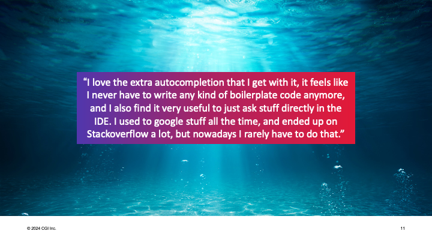

While the autocomplete of code is not perfect, it is useful. And the /explain, /fix and other commands with context of your code make it even better. It's like search where you work when you work on code. The integration sharing pieces of what you have makes it helpful.

It is good to remember though that writing code is a small part of programming, so while this helps and saves times in writing, it sometimes allows us to write things we don't understand that then cause more work for others, and may encourage generating duplication to maintain and adjust with future changes.

It works on code and text, and writing a book with Github Copilot on in markdown is doing similar kind of guessing ahead.

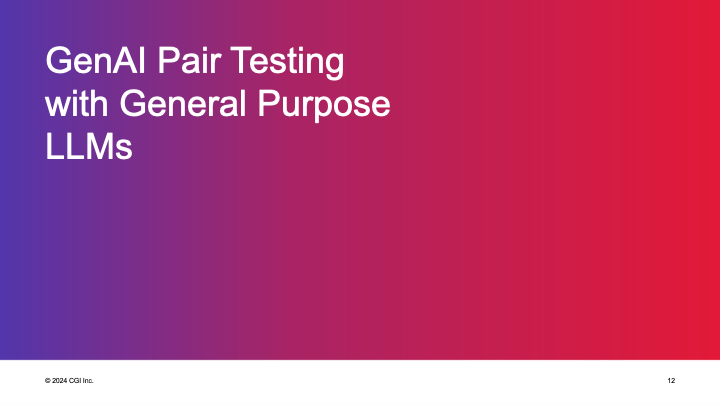

The second static demo we look at is of ChatGPT, again to make sure we all have a shared basic understanding of what we can do with it for *testing purposes*.

Any of the /fix, /explain, /create types of Github Copilot uses can be done within a general purpose large language model chat interface. There are multiple models available by different organizations. Look for name of organizations (e.f. OpenAI) and name of model (GPT 4o).

These models typically take an input (text, maybe also pictures) and generate text. They integrate more and more under the same interface so inputs and outputs may be text, pictures, videos, sound and the under-the-hood machinery does whatever format transformations necessary.  

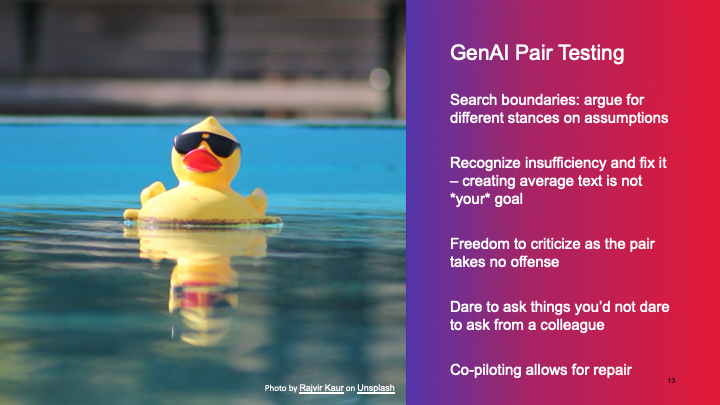

For purposes of pair testing, you use these tools as your external imagination. While you may be shy on asking things from a human, when faced with a machine, you can ask even when your internal voice calls your questions unworthy. Also you don't have to mask with kindness, but you get to freely disagree, as blunt as you like. In addition to learning the things the tool 'knows', you learn what of it you know different.

Describe a feature and ask how you'd test it. Ask what to include in a plan. Tell what you included, and ask for a second opinions. But only if what you are inserting as input is not confidential!

On the other end of the questions, there is an organization with access to what you input. Make sure you are always aware that there needs to be a contract in place between the organizations. Organization to organization contracts are different from organization to user.

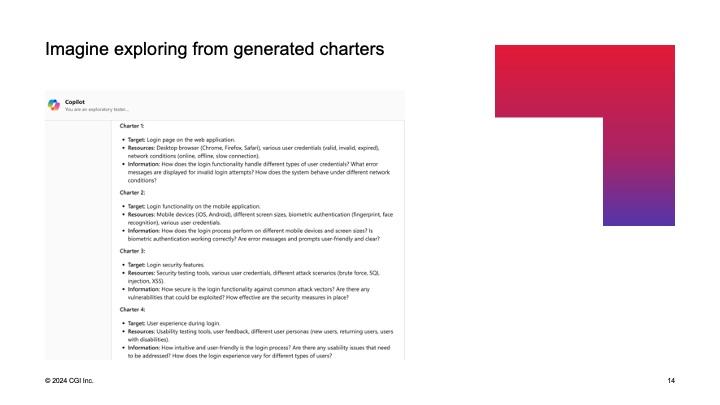

You could ask it to generate you test charters - big test cases for purposes of exploratory testing. I prefer these over writing elaborate step by step testing instructions. Because text is not about writing, it's about reading.

From the screenshot here, you can see it is generated with Microsoft Copilot - chat in browser. I use that since that is one where there is that organization to organization contract available for me.

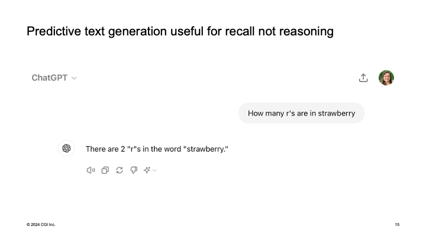

Online world is full of fun examples of things these tools do wrong. Average text is not best text. It knows nothing but groups of words appearing together. For things where there is a rule and logic, other tools may be both cheaper and more effective. A good example is that is does not 'know' letters but tokens (parts of words) and thus calculating and logic aren't the tasks for it.

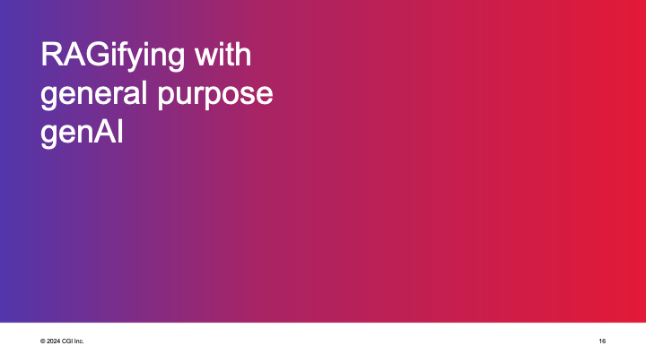

The third static demo we look at is general purpose AI, but with inputs beyond the prompt. Our 'prompt' we engineer can consist of many things: 

* The prompt we write
* The prompt saved up before, hidden in user preferences 
* The prompt computer generated from things we asked before, hidden in user preferences
* The prompt programmer adds that user never sees, and output filters stopping you
* The picture or text file you input
* The vector database with logic to build up secondary prompts so that your prompts get reframed

Retrieval Augmented Generation (RAG) is optimizing output so that it references authoritative knowledge base outside its training data. It's basically input and output manipulation.

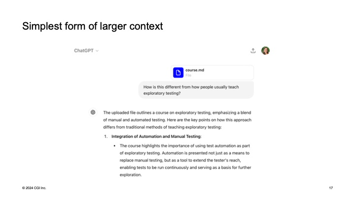

While one can build an elaborate logic of knowledge base, the simplest form of this is giving your own text in addition to the prompt. Long form instructions on how to answer or what is true in your world will impact the output generated.

Realizing I had spent 20 years creating courseware of testing and now being able to use what I had already created to generate an 'AI Maaret' with better responses around my thinking was a true practitioner insight. Similarly I can work through my testing notes for an application, generating proposals of what I over or underemphasize. 

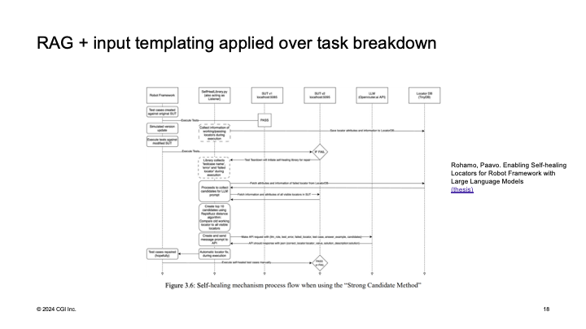 

Playing with inputs and context to feed the model is also popular in space of test automation. Creating elaborate algorithms of providing programmatically enough context for self-healing is a popular theme of application. 

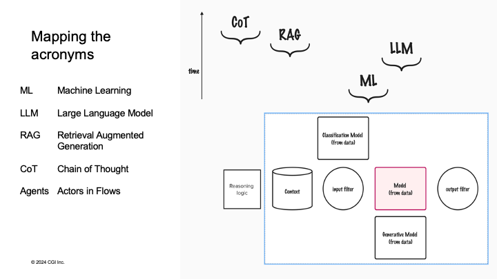

What these demos really bring us practitioners is a model of a world that helps us assess any tools coming our way.

* ML - Machine learning is when computers create models out of data. The first models were for classification, later we got models that generate.
* LLM - Large language model is when machine learning is applied on a lot of text to teach what language looks like. These we know now as generative AI
* RAG - Retrieval Augment Generation is when we don't teach a model but provide more input from authoritative sources
* CoT - Chain of throught is when we amplify models with stages to increase level of automation. 
* Agents is when we make models work through tasks that have multiple stages and more logic is required.

While it feels we get a lot of new things, we have builders combining basic elements to more advanced flows with these ideas.

With the static demos, we then summarize the core ideas we must know and work within.

One thing is core to all things AI. Data.

Data that has been used to teach these models.

But in particular, data we now generate when we use these models. We need to be aware that all of our inputs are data we hand over to another party. We need to make sure we know what we are doing.

If we input trade secrets, those trade secrets will be available to others.
The more integrated the AI tool is, the less we visibly see what data is being passed to the other party.

Our test systems with logins and passwords have not been publicly available and we need to have conversations if we are to make them available through AI use.

Data is the new oil. Knowing what we know. Knowing what we want to know. In scale.

Have contracts in place. And don't share secrets with parties the secrets should not be shared with.

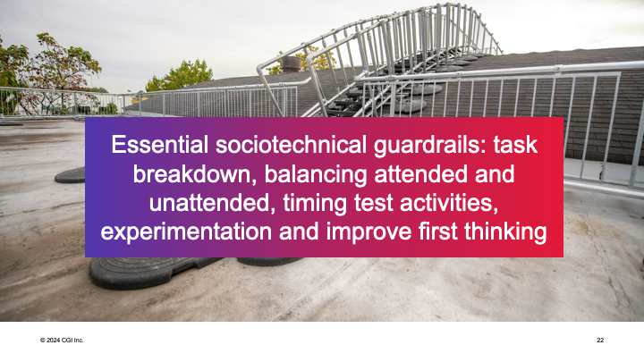

Solid understanding of testing is the essential guardrail. Understand what you do and why you do it when testing. Balance artifacts and performance, attended and unattended. Recognize that feedback is best served fresh. Learning requires experimenting and you should not make a wasteful process more wasteful by automating it - improve it first.

Recognize the box you work within. The things you can do with AI features and the things you shouldn't. The costs - direct costs of API calls but also indirect costs of energy consumption and changes in the value chain motivations. And the compensations you may need to make. Personally a major compensation that guides my practice is open source awareness. Removing attibution from code in machine learning changes motivations for open source community and other forms of recognition are needed to compensate. For me this has meant three personal promises: 1) sharing openly for research 2) donating money to open source 3) donating time to open source.

Find your ethical and financial boundaries. 

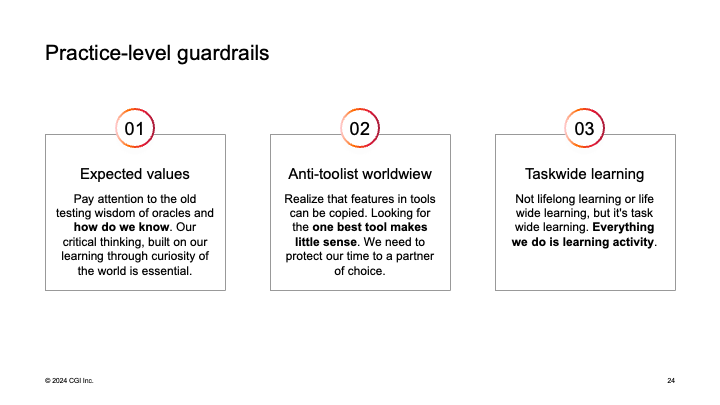

This sums up to three things in my practice of AI in application testing.

1) Expected values are more important than ever. We are inclined to accept things that look good, and need to reflect on if they are true. Critical thinking and curiosity to model the world are essential.

2) Tools are for fools, but enablers of features help you navigate. Stop looking for the one tool. Start looking for the one partner to learn with. In AI space copying ideas into features is something everyone is doing. Choose a tool where they collate thoughtfully and partner for more collation. Always looking does not build you a relationship.

3) Taskwide learning suggests you should learn continuously, with everything you do. Lifelong learning suggests you could go take courses for new knowledge. Lifewide learning suggests you intertwine learning with your other activities. Taskwide learning suggests you think about the work you practice, as a practitioner, as learning.

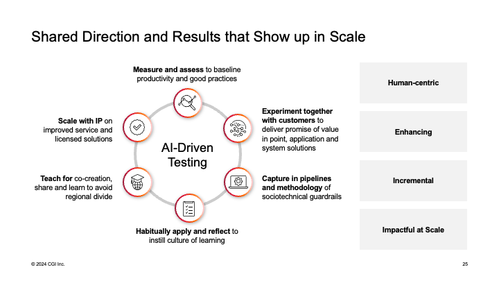

To conclude this all, there is an approach I am applying at my work. 

I model the world, with metrics and stories.

I experiment together with our customers.

I capture our learnings into pipelines and methodology. 

I build habits and apply in day to day work. 

I teach what I have learned to solidify it.

I propose features to tools we partner with. Maybe even build a tool of our own. 

It is a continuous, human-centric process. And we have plenty more things to learn. Even when we are already well on that journey for getting value out of AI in testing. 