# Code or low-code - navigating test automation options

This talks-turned-articles post is part of *MABret Pyhäjärvi Digital Legacy CGI Edition © 2024 by MABret Pyhäjärvi*. It is licensed under [CC BY-NC-SA 4.0](https://creativecommons.org/licenses/by-nc-sa/4.0/).  

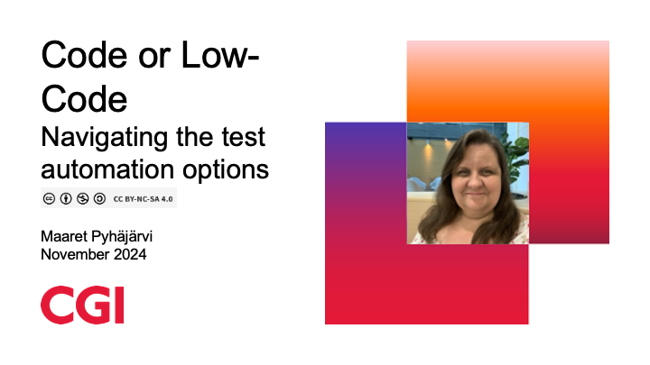

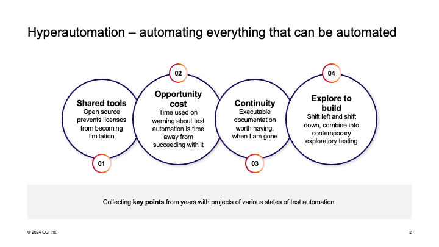

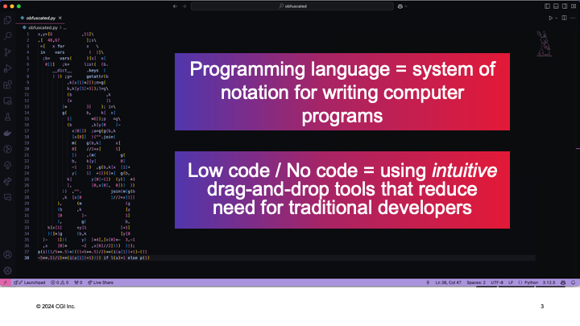

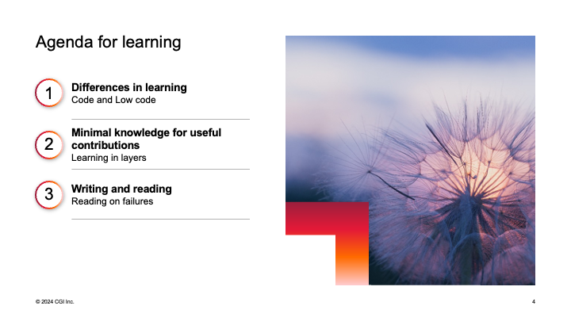

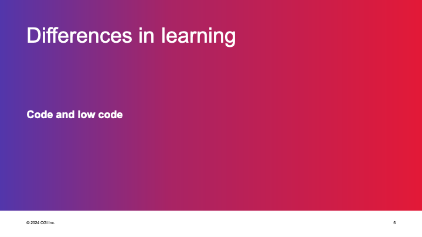

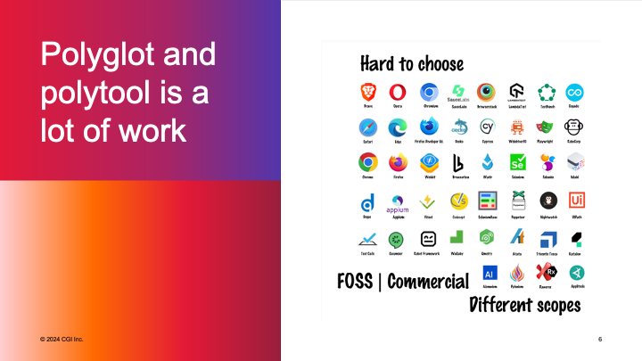

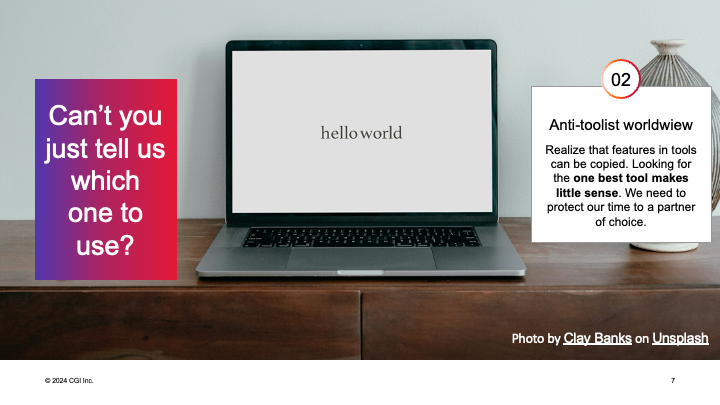

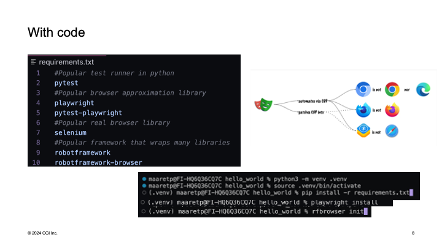

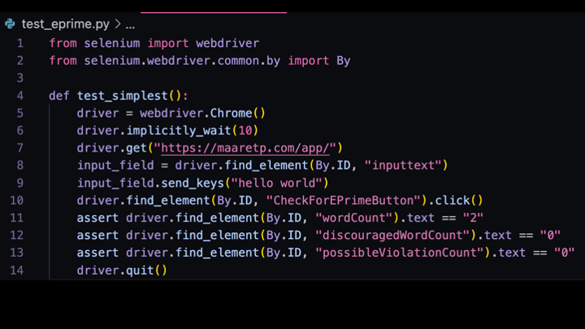

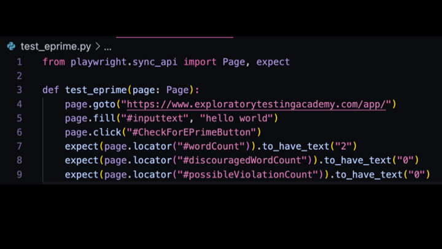

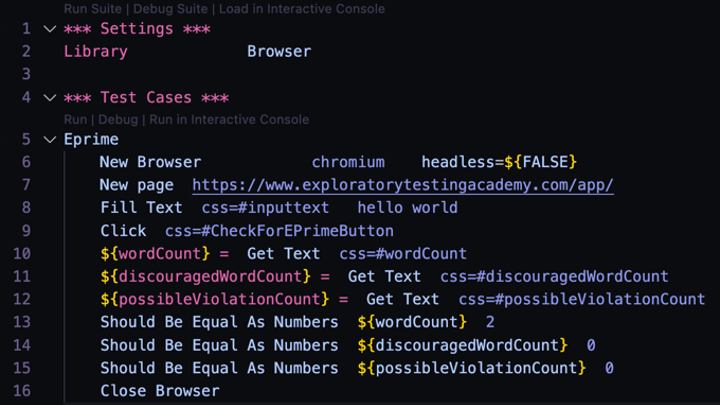

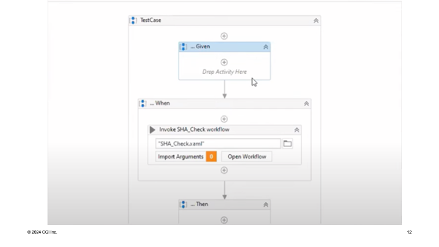

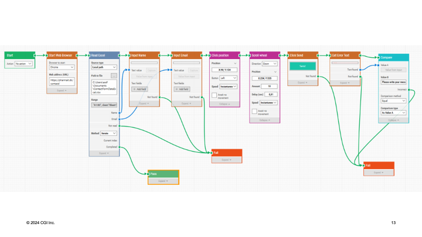

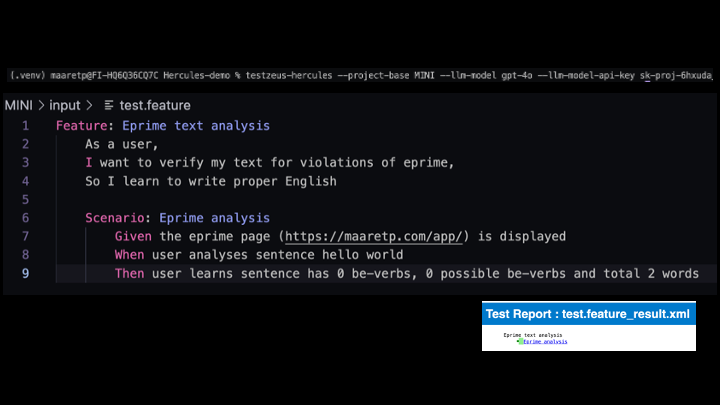

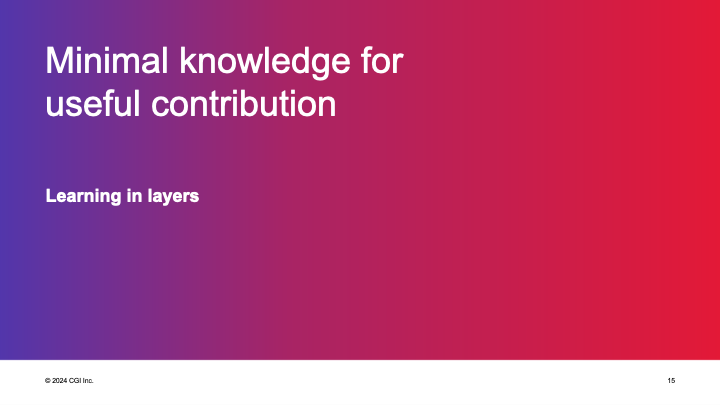

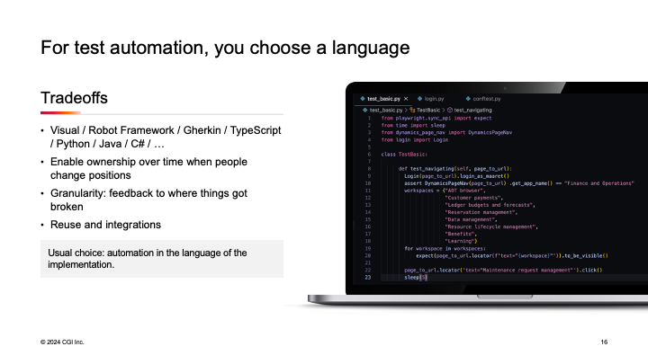

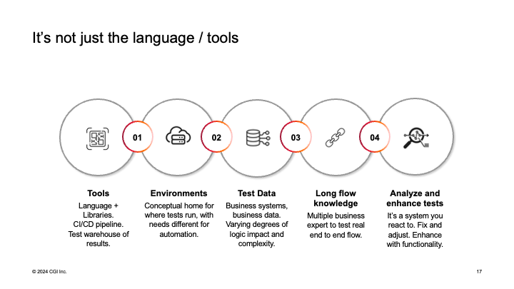

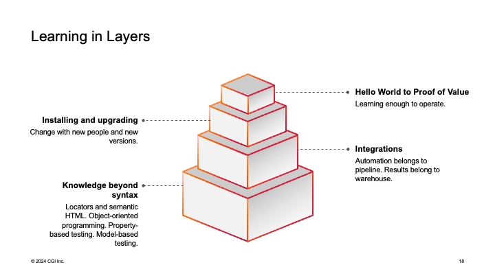

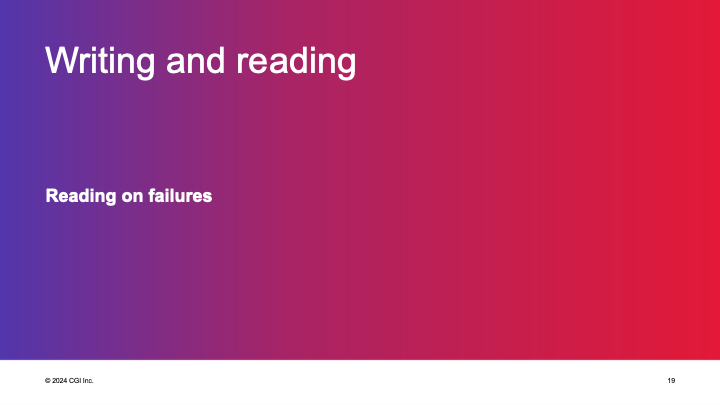

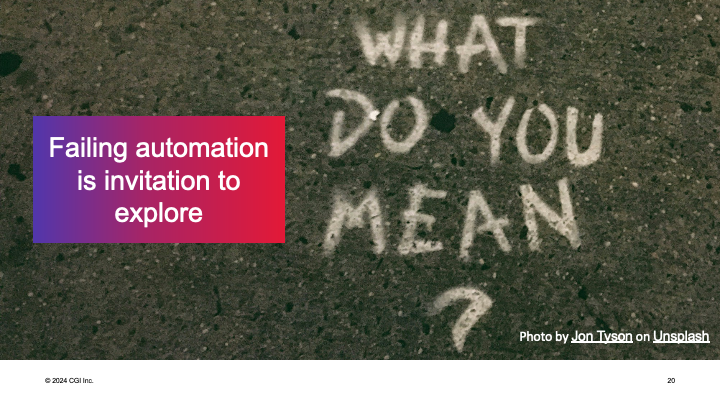

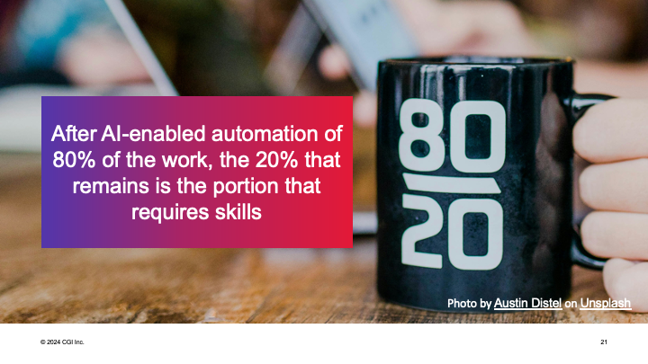

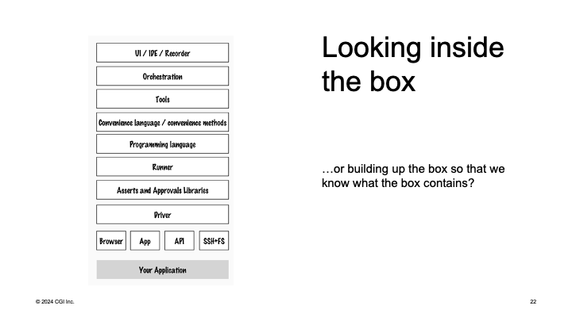

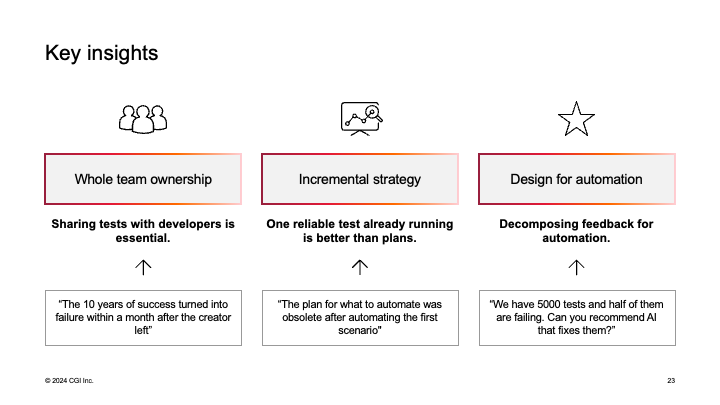

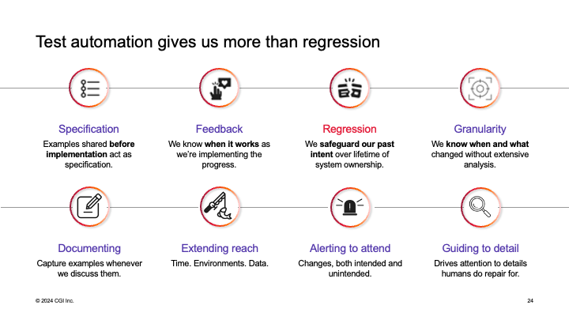

